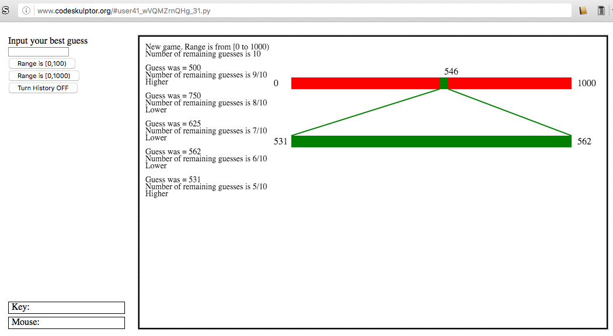

MVC pattern for Guess The Number Game
=====================================

Using the `observer.Publisher class <https://github.com/ReblochonMasque/codeskulptor_projects/blob/master/observer_pattern/observersimple.py>`_, implements a game of **Guess The Number** with the observer pattern and outputs the outcome both in console and on a GUI canvas.
The GUI provides hints on demand and shows an animated graphical representation of a binary search.

