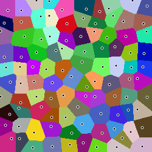
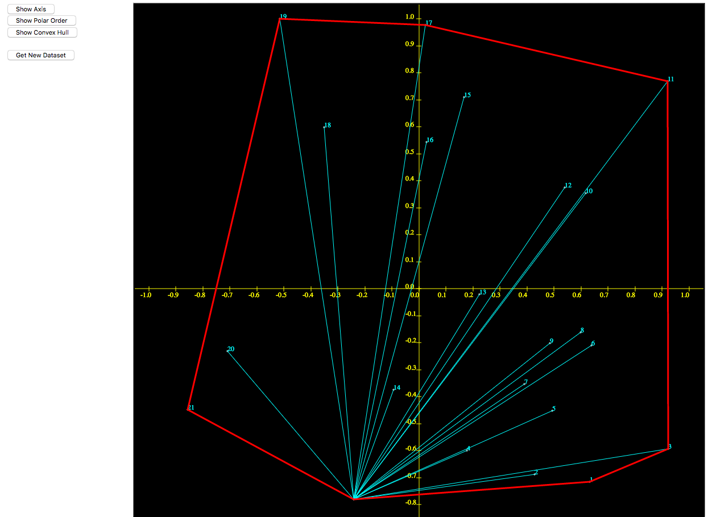

=====================
codeskulptor_projects
=====================

**A collections of experiments and python projects with codeskulptor**

Voronoi:
^^^^^^^^
A naive implementation of voronoi diagrams `<http://www.codeskulptor.org/#user41_fXerGg8nRY_2.py>`_

Convex Hull:
^^^^^^^^^^^^
A GUI/Canvas visualization of the convex hull of a cloud of points

Observer pattern
^^^^^^^^^^^^^^^^

MVC pattern for Rock Paper Scisors Lizard Spock
^^^^^^^^^^^^^^^^^^^^^^^^^^^^^^^^^^^^^^^^^^^^^^^
Using the `observer.Publisher class <https://github.com/ReblochonMasque/codeskulptor_projects/blob/master/observer_pattern/observer.py>`_, implements a game of RPSLS with the observer pattern and outputs the outcome both in console and on a GUI canvas.

.. image:: ./resources/RPSLS_GUI.png
