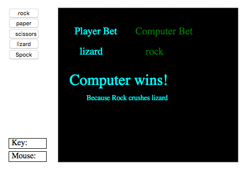

=====================
codeskulptor_projects
=====================

**A collections of experiments and python projects with codeskulptor**

Voronoi:
^^^^^^^^
A naive implementation of voronoi diagrams `<http://www.codeskulptor.org/#user41_fXerGg8nRY_2.py>`_

.. image:: ./voronoi/resources/Voronoi-Diagram-squares---offset-_-10---250-x-250.png

Convex Hull:
^^^^^^^^^^^^
A GUI/Canvas visualization of the convex hull of a cloud of points

.. image:: ./convex_hull/resources/convexhull.png

Observer pattern
^^^^^^^^^^^^^^^^
- `Publisher class <https://github.com/ReblochonMasque/codeskulptor_projects/blob/master/observer_pattern/observer.py>`_ --> elaborate/complex: various types of callbacks, different args and kwargs
- `Publisher class <https://github.com/ReblochonMasque/codeskulptor_projects/blob/master/observer_pattern/observersimple.py>`_ --> simple: one type of callback, one type of args 

MVC pattern for Rock Paper Scissors Lizard Spock
^^^^^^^^^^^^^^^^^^^^^^^^^^^^^^^^^^^^^^^^^^^^^^^
Using the `observer.Publisher class <https://github.com/ReblochonMasque/codeskulptor_projects/blob/master/observer_pattern/observer.py>`_, implements a game of RPSLS with the observer pattern and outputs the outcome both in console and on a GUI canvas.

