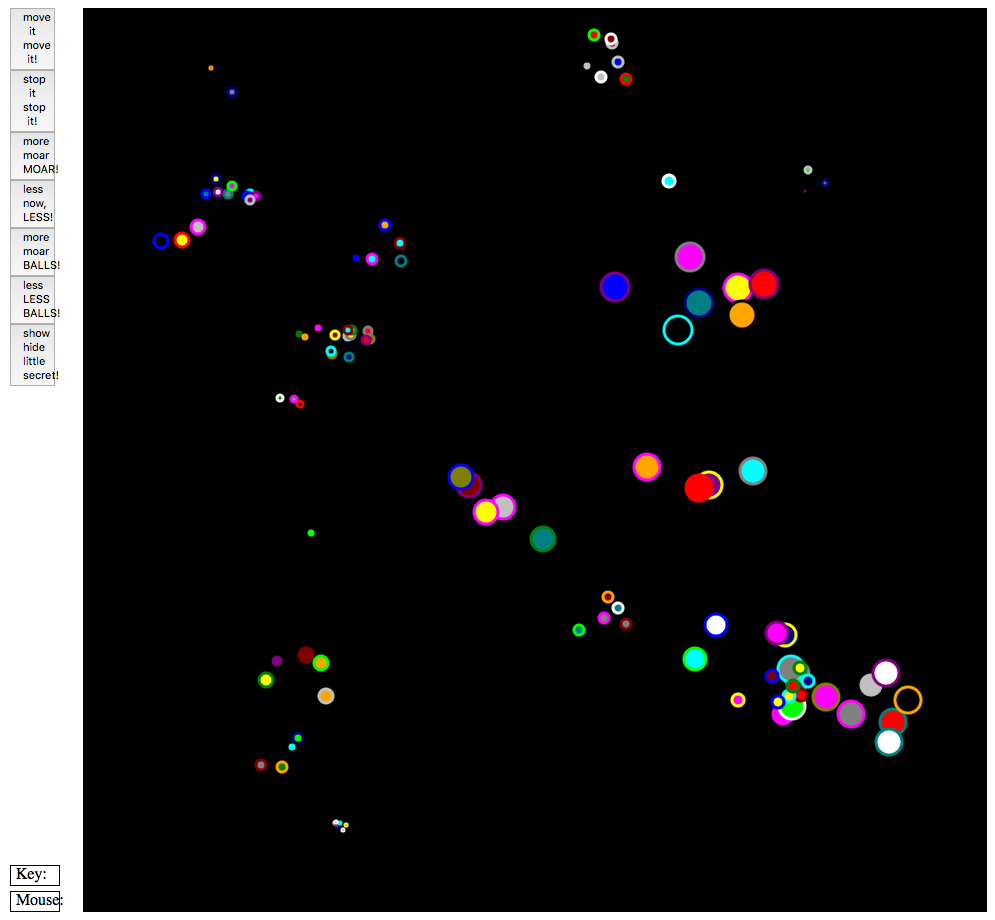

Resizable and Scalable Widgets
==============================

prototype / proof of concept for making scalable and resizable widgets to use in simplegui. This is a study in how this is done.
It ends up being a nice little canvas animation

`runs in codeskulptor <http://www.codeskulptor.org/#user41_gWz3nlsvxJ_15.py>`_ .

It is not quite there yet, I started coding too early, before I had thought through how to clearly define a widget and its behavior; that results in strong dependency between classes, and code that is not as clear and simple as I would like it to be.

**Suggestion** Do not click on the *little secret* button immediately, stare at it to let your mind figure out what are the underlying rules first.

There are "constellations" of bubbles that seem to hoover randomly... well, not that randomly after all... some seem to remain grouped and move together, while others are passing by... but there is so much noise that it appears random and it is hard to see...
It is a little bit like a real life observation; when some of the rules are hidden, it becomes quite hard to figure out the underlying logic; stare at it for a little while, add "constellations", add "balls", make put them in motion, play with it...
...then click on the little secret button to check how it is done.

