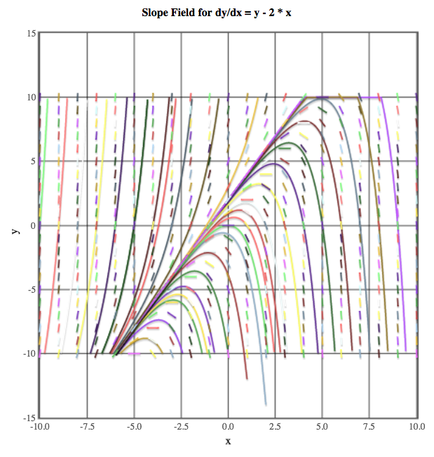

Slope Field
===========

prototype that opens the possibility to enrich **`simpleplot <http://www.codeskulptor.org/docs.html#tabs-Python>`_**'s limited capabilities.
It draws the slope field of a separable ordinary differential equation of the form: dy/dx=f(x,y)

It uses forward Euler integration to draw a set of solutions on the slope field

