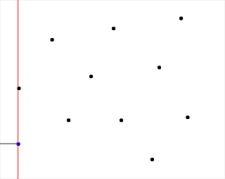

==============================================
Voronoi diagrams and how they are constructed.
==============================================

It turns out that the method I used is not naive, it is *rather dumb*! It started from the desire to draw a pretty picture instead of having a pretty picture be the consequence of a well understood problem, elegantly solved and correctly implemented.

the way to construct the graph of closest neighbor cells is called **Delaunay Triangulation**; it draws lines joining closest neighbors.

There are 3 efficient algorithms to build Voronoi that run in O(nlog(n)):

    * Fortune's line sweep algorithm that uses a "beach line of parabolas".
    * A divide and conquer that uses what I think is a KD tree.
    * And an incremental one that adds sites one by one.

The idea now is to build a Voronoi diagram as a set of edges and nodes, then use it to build a pretty picture.

Here is a gif illustrating how **Fortune's line sweep** works:

For any **sweep algorithm** the first step (to get a decent performance) is to implement a priority queue: chuck in the (x,y) coordinates of events of interest (which are the sweep line crossing a new point, I think; or a boundary parabola shrinking to a point). A PQ allows to pull events out by strictly increasing x coordinate; then decide if they're still relevant or not.

That GIF looks like it's using parabolas - which makes sense: If you take a focal point and a straight line not on that focal point, a parabola is described by the points which are equidistant from the focal point and that line. *The "obvious" bit of insight is that the vertices of the diagram are all equidistant from their nearest center points:* they _have_ to be, since they lie at the intersection of two or more lines that mark the equidistant boundary between a pair of centres.

?grow an incremental solution by looking at various cases where a new point is added: in an existing region, on an edge or at a vertex. I've no idea what the cases are yet.

The little bit of research opened a whole world. this is a very active domain; a hot topic in image recognition, path finding, data clustering, artificial intelligence, gaming, and a plethora of other applications.
...my entry point was to make cool looking images... O_O

The good news is that there is plenty of great information available (uni lectures videos, etc...)... the bad news is that there is plenty more information than I really need :) [This is the big difference between a class project and a personal one; it is hard to calibrate the scope & put a boundary around a project... I often tend to be overly ambitious too]

Approach?
---------

* a PQ is one of the necessary data structures.
* also need to keep track of sites (cell centers), edges, and cells as a collection of cyclic (closed) edges.
* probably must have access to each cell's neighbors too.
* need something sorted for the beach front - maybe a binary search tree
* also need a solid calculation of line intersections.

for adding points one at a time. Note, the diagram's not massively peturbed: it only causes local changes.

We keep track of the convex hull associated with each point; and the cells that share boundaries.

The majority of times, a new point (A) will be added inside a cell belonging to some other point, (B). Locate B(*). Begin by adding the perpendicular bisector, which I'll call AB. Search for the intersection with point(s) with B's convex hull.

Reshape B's hull accordingly and trim the line, adding it to A. Now for each endpoint unhandled: that line bordered with an unhandled cell, centre C. It will lie on the bisector of A and C (this is a trivial theorem; the AB bisector is equidistant from A and B at each point, and the BC edge was equidistant from B and C at all points; so the intersection of AB and BC is equidistant from A, B and C. Trim that bisector to C's convex hull and repeat.

[Special cases are where the convex hull is (semi-)infinite (ie, unclosed) and where A arrives either on BC directly or on a junction of >1 bisectors.]

(*) it's actually determining which convex hull we're inside in a short amount of time that's tricky here - needs a decent data structure to model it or it'll wind up being about O(n^3)

**This is a big project!**

It is probably better baby step into it and take time; maybe start with a **convex hull** to get a better appraisal of the size of the problem.