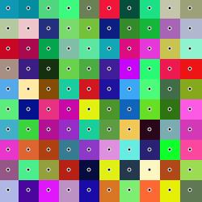

Voronoi Diagram
===============

This experiment draws a `colored voronoi diagram <http://www.codeskulptor.org/#user41_fXerGg8nRY_2.py>`_ and allows to capture the final result as a png image (although it will need to be saved manually).

The implementation is very naive: for each pixel it calculates which cell center is closest and colors it.

The use of a dictionary to contain the image definition is not mandatory - I chose it because I was unsure how I would eventually display the image. It turns out that a nested list might have been better.

.. image:: ./resources/Voronoi-Diagram-squares---offset-_-10---250-x-250.png

.. image:: ./resources/voronoi-Diagram-500-x-500.png
